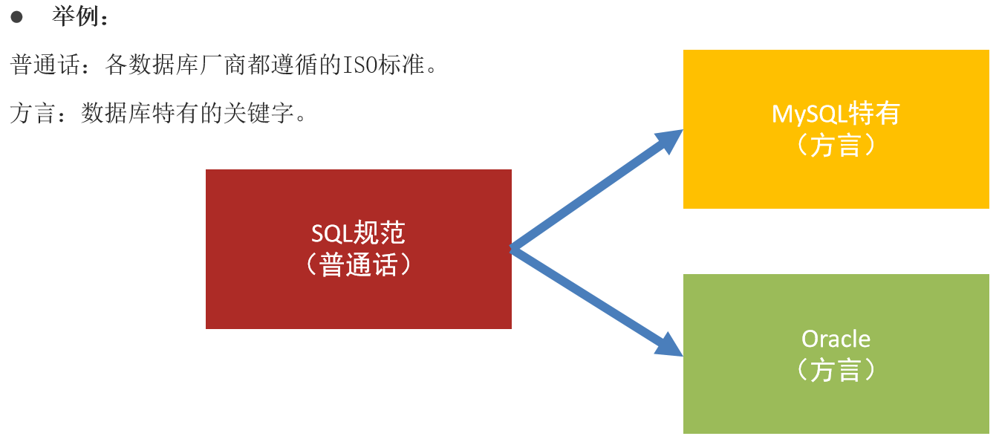

# day01_mysql入门

## 一.SQL概念

```sql
SQL概念: 结构化查询语言（Structured Query Language）简称SQL


SQL简介: 是一种特殊的编程语言，是一种数据库查询和程序设计语言，用于存取数据以及查询、更新和管理关系数据库系统

对于在大数据python，全栈领域开始职业生涯的我们来说，SQL是一种必不可少的编程语言。
网络安全 非常广泛的
```

## 二.SQL和MySQL

### 数据库

```sql
数据库概念:  存储数据的仓库

数据库分类:  关系型数据库 和 非关系型数据库

关系型数据库: SQL,强调以二维表格形式存数据   举例:  MySQL,ORACLE,DB2,Sqlserver,SQLite
二维表格：和Excel表格是一毛一样的 

非关系型数据库: NoSQL,强调以键值对key-value形式存数据{key:value}   举例: Hbase,redis,mongoDB
```

### SQL分类

```sql
SQL概念: 结构化查询语言（Structured Query Language）简称SQL

SQL规范: 是所有关系型数据库管理系统都要遵循的规范

SQL分类: DDL  DML  DQL  DCL   增删改查

数据定义语言:简称DDL(Data Definition Language)   
用来定义数据库对象：数据库，表，列等。 
关键字:create，alter，drop等

数据操作语言:简称DML(Data Manipulation Language) 
用来对数据库中表的记录进行更新。      
关键字：insert，delete，update等

数据查询语言:简称DQL(Data Query Language)        
用来查询数据库中表的记录。           
关键字：select，from，where等

数据控制语言:简称DCL(Data Control Language)      
用来定义数据库的访问权限和安全级别，及创建用户,了解即可。root、mysqluser1，
```

### SQL和MySQL的关系

```properties
Mysql属于关系型数据库,所以需要遵循SQL规范
```



SQL 是一种语言，而 MySQL 是一个基于 SQL 的数据库管理系统，是一个具体的软件，SQL 是 MySQL 用来操作和管理数据的语言。换句话说，MySQL 是 SQL 的具体实现之一。

### MySQL连接

>MySQL: 最流行的关系型数据库管理系统之一    

### 命令行操作

```properties
mysql登录:
	方式1: mysql -u用户名 -p密码
	方式2: mysql -u用户名 -p回车后再输入密码
mysql登出: 
	方式1: exit;
```

### MySQL类型

```sql
整数: int   默认长度是11位

浮点数: float:python默认浮点类型  double:java默认浮点类型 

日期时间: date:年月日  datetime: 年月日时分秒   timestamp: 时间戳,从1970年1月1日到现在的秒/毫秒
了解创建表的时候会带大家了解
字符串类型: char()  varchar(可变长度)   python：string
```

## 三.MySQL操作[重点]

### 1.数据库的增删改查

>数据库英文单词: ==database==

#### 知识点:

```sql
创建数据库: create database [if not exists] 库名 [DEFAULT CHARACTER SET utf8];

删除数据库: drop database 库名;

切换数据库: use 库名;

查看所有数据库: show databases;
查看当前使用的是哪个数据库: select database();
```

#### 示例:

```sql
# 一.数据库增删改查
# 1.创建数据库: create database 库名;
create database test1;
# 如果数据库已经存在再次创建的时候会报错如何解决? if not exists
-- 注意: 如果库不存在就创建,存在就不创建
create database if not exists test1;
create database if not exists test2;
# 如果数据库数据中文容易出现乱码如何解决? charset utf8
create database test3 CHARACTER SET utf8;

# 删除数据库: drop database 库名;
drop database test3;

# 切换数据库: use 库名;
use test1;
use test2;

# 查看所有数据库: show databases;
show databases;
# 查看当前使用的是哪个数据库: select database();
select database();
```

## 四.表的基本操作

>表的英文单词: ==table==

### 知识点:

```properties
创建表: create table  表名(字段名 字段类型, 字段名 字段类型, ...);

删除表: drop table 表名;

修改表名:  rename table 旧表名 to 新表名;

查看所有表: show tables;

查看指定表的结构: desc 表名;
```

### 示例:

```sql
# 操作表的前提是先有库并且使用它
# 回顾创建库
create database day02;
# 回顾使用库
use day02;

# 一.演示表的基本操作
# 创建表: create table [if not exists] 表名(字段名 字段类型 [约束] , 字段名 字段类型 [约束] , ...);
create table student(id int, name varchar(100) , age int);
# if not exists: 如果存在不创建也不报错
create table if not exists student(id int, name varchar(100) , age int);
# if not exists: 如果不存在就创建
create table if not exists student2(id int, name varchar(100) , age int);

# 删除表: drop table 表名;
drop table student2;

# 修改表名:  rename table 旧表名 to 新表名;
rename table student to stu1;

# 查看所有表: show tables;
show tables;

# 查看指定表的结构: desc 表名;
desc stu1;
```

## 五.表中字段的操作

>字段/列的英文单词: ==**column**==
>
>操作字段/列的本质就是在修改表

### 知识点:

```properties
在表中添加一列: alter table 表名 add  字段名 字段类型;

在表中删除一列: alter table 表名 drop  字段名;

在表中修改列名和类型: alter table 表名 change 旧字段名 新字段名 新字段类型;
在表中只修改类型:    alter table 表名 modify  旧字段名 新字段类型;
注意: 建议大家以后都用change,因为change既能单独修改名也能单独修改类型而且还可以同时修改名称和类型,而modify只能改类型

查看指定表中字段信息: desc 表名;
```

### 示例:

```sql
# 二.演示表中字段的操作
# 在表中添加一列: alter table 表名 add [column] 字段名 字段类型;
# 需求1:添加一列class,类型为字符串
alter table stu1 add column class varchar(100);
# -- 注意: column可以省略
alter table stu1 add  hight double;

# 在表中删除一列: alter table 表名 drop [column] 字段名;
# 需求2:删除age这一列
alter table stu1 drop column age;
# -- 注意: column可以省略
alter table stu1 drop hight;

# 在表中修改列名和类型: alter table 表名 change [column] 旧字段名 新字段名 新字段类型;
# 需求3:修改id名为sid,同时修改类型为字符串
alter table stu1 change column id sid varchar(100);
-- 注意: change也可以单独修改类型,注意名称即使不修改也要写两遍
alter table stu1 change column sid sid int;

# 在表中只修改类型: alter table 表名 modify [column] 旧字段名 新字段类型;
# 需求4:修改class字段类型为int
alter table stu1 modify column class int;
# 注意: 建议大家以后都用change,因为change既能单独修改名也能单独修改类型而且还可以同时修改

# 查看指定表的结构: desc 表名;
desc stu1;
```

## 六.表中记录的操作

### 知识点:

```sql
往表中插入记录: 
	插入一条: insert into 表名 (字段1名,字段2名, ...) values (值1,值2, ...);
	插入多条: insert into 表名 (字段1名,字段2名, ...) values (值1,值2, ...) , (值1,值2, ...) , (值1,值2, ...);
	注意: 如果插入的记录是包含所有字段,那么表名后面可以省略字段,默认就是所有字段
	
在表中修改记录:
	修改部分记录: update 表名 set 字段名=值 where 条件;
	修改所有记录(慎用): update 表名 set 字段名=值;
      
从表中删除记录:
	删除部分记录: delete from 表名 where 条件;
	删除所有记录方式1: delete from 表名;
```

### 示例:

```sql
# 三.演示表中记录的操作
# 1.插入操作
# 操作记录的前提要有表
# 需求: 往stu1表中一次插入1条数据
insert into stu1 (sid, name, class) values (1,'张三',52);
insert into stu1 (sid, name) values (1,'张三');
-- 注意: 如果插入的数据是所有字段,那么可以不指定字段插入
insert into stu1 values (2,'李四',52);

# 需求: 往stu1表中一次插入多条数据
insert into stu1 (sid, name, class) values (3,'王五',52),(4,'赵六',52),(5,'田七',52);
-- 注意: 如果插入的数据是所有字段,那么可以不指定字段插入
insert into stu1 values (6,'王五2',52),(7,'赵六2',52),(8,'田七2',52);


# 2.修改操作
# 需求: 修改李四的班级为53期
update stu1 set class=53 where name = '李四';
# 需求: 修改所有学生班级改为54
update stu1 set class=54; -- 慎用! 


# 3.删除操作
# 需求: 删除李四这条记录
delete from stu1 where name = '李四';
# 需求: 使用delete删除所有学生信息
delete from stu1; -- 慎用! 

```

