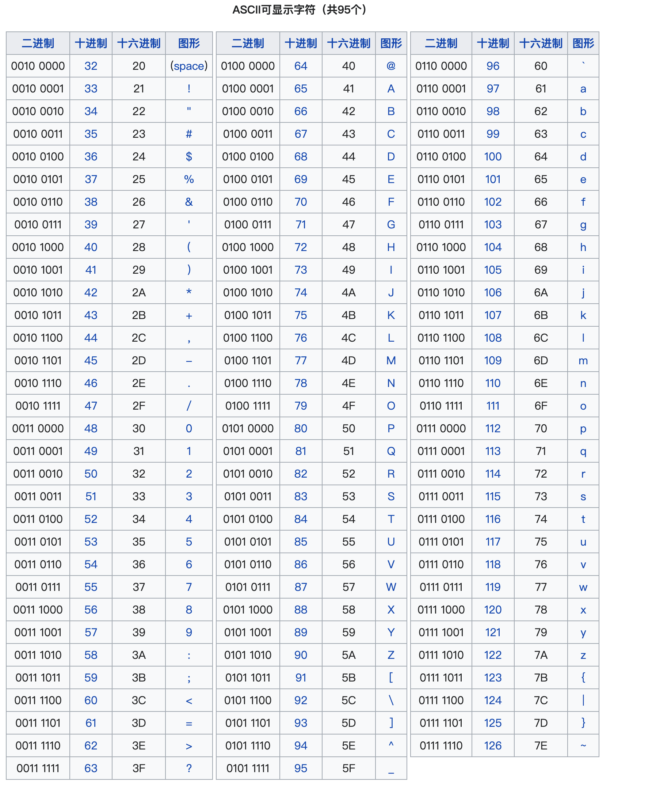
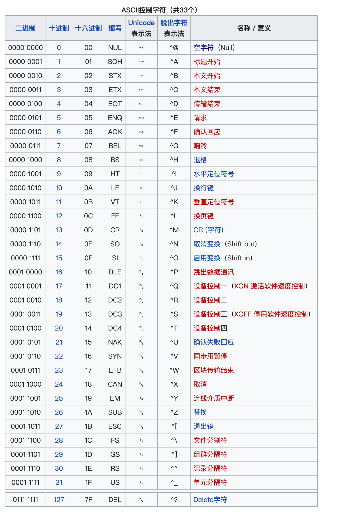

Understanding how ASCII values are used in MySQL for string comparisons and data extraction.
### 字符串为什么有时转成 ASCII 数字？

布尔盲注的核心是比较大小。字符串之间比较大小限制很多，无法精确猜解。而 **ASCII 数字是纯数值**，可以用 `>`、`<`、`=` 做精确二分法。

### 爆出的不只是大小写字母和数字

脚本里的 `range(32, 127)`，这个范围涵盖了所有 **可打印 ASCII 字符**：

| ASCII 范围 | 内容    | 示例                                                                        |
| -------- | ----- | ------------------------------------------------------------------------- |
| 32       | 空格    |                                                                           |
| 33-47    | 特殊符号  | `!`, `"`, `#`, `$`, `%`, `&`, `'`, `(`, `)`, `*`, `+`, `,`, `-`, `.`, `/` |
| 48-57    | 数字    | `0` - `9`                                                                 |
| 58-64    | 更多符号  | `:`, `;`, `<`, `=`, `>`, `?`, `@`                                         |
| 65-90    | 大写字母  | `A` - `Z`                                                                 |
| 91-96    | 又一批符号 | `[`, `\`, `]`, `^`, `_`, `` ` ``                                          |
| 97-122   | 小写字母  | `a` - `z`                                                                 |
| 123-126  | 最后的符号 | `{`,  \| , `}`, `~`                                                       |








所以，脚本能爆出：

-  **大小写字母** `A-Z` `a-z`
    
-  **数字** `0-9`
    
-  **所有键盘上的特殊符号** `!@#$%^&*()_+-=[]{}|;':",./<>?`
    
-  **空格**
    
-  **任何英文标点**
    

实际上，**只要是键盘上能敲出来的东西，它都能爆出来。**

```python
for ascii_code in range(32, 127):  # 可打印字符范围
```

### 二分查找爆破数据库


